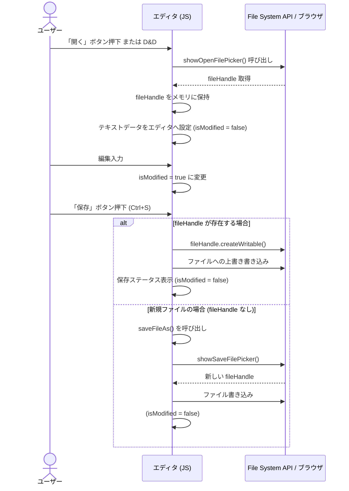

# ブラウザMDエディタ（browser_md_editor）設計書

本ドキュメントは、ブラウザ上で動作する軽量Markdownエディタ「browser_md_editor」の設計仕様書です。

---

## 1. システム概要

### 1.1. コンセプト
本アプリケーションは、**「インストール不要で、ブラウザがあればどこでも動作する、セキュリティ的にもクローズドな軽量Markdownエディタ」**です。
単一の HTML ファイル（Single File SPA）として設計されており、ローカル環境でも、静的Webサーバー上にデプロブされた環境でも同様に動作します。

### 1.2. 主要な特徴
*   **ゼロ・バックエンド**: サーバーサイド処理を一切行わず、クライアントサイド（ブラウザ）のみで完結。
*   **Mermaid 統合**: リアルタイムで Mermaid による図表（フローチャート、シーケンス図等）をレンダリング。
*   **ローカルファイル直接編集**: File System Access API に対応し、ローカルの `.md` ファイルを直接開いて上書き保存が可能。
*   **レスポンシブ & マルチデバイス**: PC、iPad、スマートフォン等の各種画面幅に最適化。
*   **高コントラスト・ダークモード**: 眩しさを低減し、シンタックスハイライトが際立つテーマ設計。

---

## 2. システム構成・使用技術

外部の CDN からライブラリを読み込み、コア機能を実現しています。

| ライブラリ / 技術 | バージョン | 役割 |
| :--- | :--- | :--- |
| **HTML5 / CSS3 / ES6** | - | 標準技術。CSS変数を利用したテーマ管理および印刷制御。 |
| **CodeMirror** | 5.65.13 | エディタのコア。シンタックスハイライト、行番号、各種キーバインドの提供。 |
| **marked.js** | 13.x 相当 | MarkdownからHTMLへのパース処理。 |
| **Mermaid.js** | 10 | テキストからのグラフ・図表のリアルタイム描画。 |

---

## 3. 機能要件

### 3.1. エディタ機能
*   **シンタックスハイライト**: Markdown構文（見出し、リスト、リンク、引用、強調など）をエディタ内で色分け表示。
*   **不可視文字の可視化**: 半角スペース（`·`）、全角スペース（`□`）、タブ（`→`）を専用オーバーレイで可視化。
*   **スクロール同期**: エディタとプレビューエリアが双方向にスクロールパーセンテージで同期。
*   **キーボードショートカット**:
    *   `Ctrl/Cmd + S`: 保存
    *   `Ctrl/Cmd + B`: 太字（`**`）挿入/囲み
    *   `Ctrl/Cmd + I`: 斜体（`*`）挿入/囲み
    *   `Ctrl/Cmd + U`: 下線（`<u>`）挿入/囲み
    *   `Enter` / `Shift-Enter`: 改行モードに応じた制御

### 3.2. ファイル操作
*   **新規作成**: エディタをクリアし、未保存ハンドルをリセット。
*   **ファイルを開く**:
    *   *推奨ブラウザ*: File System Access API でローカルファイルを選択。
    *   *フォールバック*: `<input type="file">` による一時読み込み。
*   **ドラッグ＆ドロップ (D&D) 読み込み**: ファイルをブラウザ上にドロップすることで、直接編集を開始。
*   **保存**: 開いているローカルファイルへの直接上書き保存（未保存時は別名保存を促す）。非対応ブラウザではダウンロード（blob）フォールバック。
*   **別名保存**: 常にファイル選択ダイアログを開き、新しいファイルとして保存。

### 3.3. プレビューと描画
*   **リアルタイムプレビュー**: 入力と同時に Markdown をパースして反映。
*   **Mermaid リアルタイムレンダリング**:
    *   ```mermaid で囲まれたコードブロックを検知し、自動的に図に変換。
    *   タイピングごとの過度な再描画を防ぐため、**300msのデバウンス処理**を適用。
    *   構文エラー時は、描画を崩さずにエラーメッセージとエラー箇所のコードを表示。

### 3.4. 画面・表示モード
*   **3つのレイアウトモード**: 「編集のみ」「両方（分割）」「表示のみ」をワンクリックで切り替え。
*   **カラーテーマ**: 「ライトモード」「ダークモード」の切り替え。Mermaid の図のテーマも連動して動的に変更。
*   **PDF出力 (印刷)**: 印刷用CSS (`@media print`) を最適化し、ツールバーやエディタを隠してプレビュー内容のみを綺麗にA4等のサイズでPDF保存・印刷可能。

---

## 4. UI設計・画面レイアウト

### 4.1. 画面構成
```
+-------------------------------------------------------------------------+
| [新規] [開く] [保存] [別名] [PDF] [改行] [テーマ]  ...  [編集][両方][表示] | <-- ツールバー
+------------------------------------+------------------------------------+
|                                    |                                    |
|                                    |                                    |
|                                    |                                    |
|          CodeMirror エディタ        |          プレビューエリア           |
|            (Markdown 入力)          |           (HTML / Mermaid)         |
|                                    |                                    |
|                                    |                                    |
|                                    |                                    |
+------------------------------------+------------------------------------+
```

### 4.2. レスポンシブ設計
*   **モバイル/タブレットサイズ (幅 768px 以下)**:
    *   自動的に初期表示を「編集のみ（editor）」モードに変更。
    *   ツールバーボタンのパディングとサイズをタップしやすいサイズ（最小高さ32px）に縮小。
    *   ツールバー内のアイテムの折り返し (`flex-wrap: wrap`) を許容。

---

## 5. 詳細設計（内部処理）

### 5.1. ファイル保存・読み込みライフサイクル



### 5.2. Mermaid レンダリングとデバウンス処理
1.  **カスタム Markdown レンダラー**:
    marked.js のパーサーを拡張し、コードブロックの言語が `mermaid` の場合は HTML 文字列を生成する代わりに、一時的に `<div class="mermaid-preview" data-code="...">` というプレースホルダー要素を生成します。
2.  **非同期描画とデバウンス**:
    エディタで文字が入力されるたびに `updatePreview` がトリガーされますが、Mermaid の描画処理には時間（コスト）がかかるため、**300msのディレイ**を置きます。タイピングが一時停止すると、`renderMermaidDiagrams` が非同期に実行され、プレースホルダーを実際の SVG 要素へ置き換えます。
3.  **エラーハンドリング**:
    描画処理（`mermaid.render`）を `try-catch` で囲み、構文にエラーがある場合はエラー文言と対象コードを赤いボックスでプレビューエリアにレンダリングします。これにより、入力中の構文エラーで画面全体のレンダリングがフリーズするのを防いでいます。

### 5.3. 改行モード（標準 / 強制）の制御
Markdown では通常、文文末に「半角スペース2つ」を入力しないと改行（`<br>`）として処理されませんが、これをトグルで制御できるようにしています。

*   **改行: 標準 (brModeStrict = false)**
    *   `Enter`: 通常の改行 `\n` を挿入。
    *   `Shift-Enter`: 強制改行の `  \n` (スペース2つ+改行) を挿入。
*   **改行: 強制 (brModeStrict = true)**
    *   `Enter`: 強制改行 `  \n` を挿入。一般的なテキストエディタに近い感覚で Markdown を記述可能。
    *   `Shift-Enter`: 通常の改行 `\n` を挿入。

---

## 6. デプロイフロー (CI/CD)

GitHub Actions を利用したデプロイ自動化が組み込まれています。

### 6.1. ワークフロー概要
*   **トリガー**: `main` ブランクへのコードプッシュ。
*   **実行環境**: `ubuntu-latest`
*   **配信先**: 自社管理等のプライベート静的ホスティング環境 (`/opt/docker/static-app/html/browser_md_editor/`)。

### 6.2. デプロイ手順詳細
1.  **コードのチェックアウト**: `actions/checkout@v4` を使用してリポジトリの最新ソースを取得。
2.  **Cloudflare Tunnel クライアントのセットアップ**: `cloudflared` をランナーにインストール。ファイアウォール内の対象サーバーに安全に接続するためのプロキシを設定。
3.  **SSH構成設定**: GitHub Secrets から取得したプライベートキーと Cloudflare サービスパス用のトークンを用いて、一時的な `~/.ssh/config` を構築。これにより、パブリックインターネットにSSHポートを開放することなく、Cloudflare Tunnel 経由でのセキュアなアクセスを可能にします。
4.  **ファイルの転送 (SCP)**: `browser_md_editor.html` のみをターゲットサーバーへ転送。ビルドステップがないため、転送後即座に反映されます。
